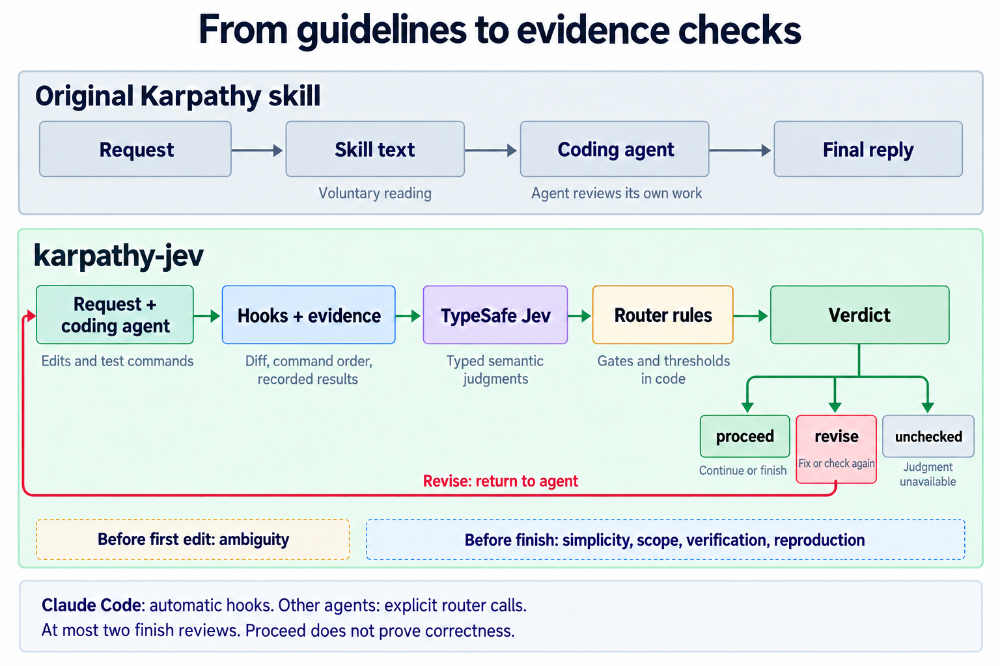

# Karpathy Guidelines with Jev Checks

A Claude Code plugin that asks [TypeSafe Jev](https://typesafe.ai) to check whether the agent followed
[Karpathy's coding guidelines](https://github.com/multica-ai/andrej-karpathy-skills).

It checks assumptions before editing, and simplicity, scope, and verification before finishing.
The plugin includes both the skill and the hooks that run these checks automatically.

[Comparison](#comparison-with-the-original-skill) · [Install](#install) · [The four principles](#the-four-principles) · [How it works](#how-it-works) · [Results](#results)

## Comparison with the Original Skill

| Aspect | Native agent | Baseline: original Karpathy skill | karpathy-jev |
|---|---|---|---|
| Added guidelines | None | Skill text | Skill text and router |
| Who checks compliance? | Agent | Agent | Jev judges evidence; code applies rules |
| Runs if the skill text is never opened? | No added check | No | Yes, with Claude Code hooks |
| Diff and command evidence collected by a router? | No | No | Yes |
| Hidden pipeline failures handled? | No added handling | No added handling | `pipefail` and result parsing |
| External judge required? | No | No | TypeSafe API key |
| Support outside Claude Code | Agent's own behaviour | Voluntary skill use | Explicit router calls |
| Claude Code / Sonnet 5: tasks resolved | 18/20 | 19/20 | **20/20** |
| Codex / GPT-5.5: tasks resolved | 16/20 | 16/20 | **17/20** |

**Performance rows:** historical “fixed” version, SWE-bench Verified, 20 tasks per method, one attempt
each. Sonnet 5 used Claude Code hooks; GPT-5.5 used voluntary calls in Codex. The small sample does not
establish a reliable success gain, and claim calibration and strict-verification audits remain
incomplete. See [Results](#results) for definitions and costs.

These are differences in the added mechanism. A native agent can still ask questions, make a small
patch, and run tests on its own.

The historical Sonnet comparison reported that the original skill was never opened (0/20), while
hooks ran this router automatically. It also reported 10/20 Jev runs ending with a block still open;
that count does not establish that every block was correct. See the
[evaluation details](eval/EVALUATION.md) for the reported outcomes and audit limits.



*Jev supplies judgments; code applies gates and thresholds. Claude Code invokes the router through
hooks, while other agents must call it explicitly. Finishing checks are limited to two reviews.*

## Install

Requires **Python 3.6+** and a **TypeSafe API key**. Make the key available through `TYPESAFE_API_KEY`
or the private file `~/.karpathy-jev/key` before starting Claude Code.

### Option A: Claude Code plugin — recommended

From inside Claude Code **2.1.275 or later**, install with one command:

```text
/plugin install karpathy-jev --marketplace reliable-era/andrej-karpathy-skills-jev
```

Choose the installation scope when prompted. This installs **the skill and its hooks together**;
there is no need to copy files or edit hook commands. Follow Claude Code's install summary if it
requests a reload.

From a terminal with Claude Code **2.1.292 or later**, the equivalent is:

```bash
claude plugin install karpathy-jev --marketplace reliable-era/andrej-karpathy-skills-jev
```

See [Claude Code's plugin installation guide](https://code.claude.com/docs/en/discover-plugins#add-a-marketplace-and-install-in-one-command)
for the supported installation scopes.

### Option B: Install from a local checkout

Run this once, replacing the path with your checkout:

```bash
claude plugin install karpathy-jev --marketplace /absolute/path/to/andrej-karpathy-skills-jev
```

To load the plugin for just one session, start Claude Code from your target project:

```bash
claude --plugin-dir /absolute/path/to/andrej-karpathy-skills-jev
```

Both options load the bundled skill and hooks. Copying only `SKILL.md` or the skill folder does not
provide automatic checks.

## The Problems

A coding agent can make an assumption without checking it, build more than the request needs, change
unrelated files, or say “done” without testing its final edit.

The original Karpathy skill gives the agent rules for avoiding these mistakes. This plugin adds
checks of the work the agent actually performed.

## The Solution

The agent writes the code. Jev judges specific questions about the request, diff, and command results.
The router applies the configured rules and can ask the agent to revise its work.

| Principle | What the router checks |
|---|---|
| **Think Before Coding** | Does an unclear request need clarification before the first edit? |
| **Simplicity First** | Does the patch contain work the request does not need? |
| **Surgical Changes** | Are the changed hunks relevant to the request? |
| **Goal-Driven Execution** | Was the final change checked? For a bug fix, was the failure reproduced first? |

For example, an agent writes “fixed, tests pass,” but its last test ran **before** the final edit.
The router can request a relevant test after that edit before allowing it to finish.

<details id="the-four-principles">
<summary><strong>The Four Principles</strong></summary>

### 1. Think Before Coding

Explain consequential assumptions. Ask when the request has several plausible interpretations.
The first-edit check asks Jev whether the agent needs to address ambiguity.

### 2. Simplicity First

Implement what the request needs. Avoid speculative features and unnecessary abstractions.
The finishing check asks Jev whether parts of the diff could be removed without losing requested work.

### 3. Surgical Changes

Keep every change relevant to the request. Mention unrelated problems instead of quietly fixing them.
The scope check compares changed hunks with the request.

### 4. Goal-Driven Execution

Define a check that exercises the requested behaviour. For a bug fix, reproduce the failure before
changing production code, then run a relevant check after the final edit.

```text
1. Reproduce the bug → observe a failing check.
2. Make the fix      → change the necessary code.
3. Verify the fix    → run a passing check after the final edit.
```

The router looks for this evidence. A passing test can still miss a bug, and Jev can make a wrong
judgment.

</details>

## How it works

```text
Request → agent works → router collects evidence → Jev judges → continue or revise
```

| When | What happens |
|---|---|
| A request starts | Record the request and the starting Git state. |
| Before the first edit | Ask Jev whether ambiguity needs to be addressed. |
| Before a shell pipeline | Add `pipefail` so a failed check is not hidden by a successful output filter. |
| Before finishing after edits | Review simplicity, scope, final verification, and bug reproduction where applicable. |

The evidence includes the code diff, command order, recorded results, output excerpts, and relevant
user/agent messages. Jev answers narrow questions about that evidence; the router applies the
configured rules and thresholds.

- **`proceed`:** no applicable check blocks completion.
- **`revise`:** address the reported problem; the revision can be judged once more.
- **`unchecked`:** Jev was unreachable or required answers were missing or malformed.

Checks are bounded to two finishing reviews. An unavailable judge does not block the agent.
**`proceed` is permission to continue, not proof that the code is correct.**

See the [decision rules](skills/karpathy-jev/references/decisions.md) and
[router design](skills/karpathy-jev/references/design.md) for the exact questions and thresholds.

## Using with Other Agents

### Pi 1.1.0: experimental automatic adapter

From the target repository, load the extension and skill from this checkout:

```bash
pi --extension /absolute/path/to/karpathy-jev/extensions/karpathy-jev.ts \
   --skill /absolute/path/to/karpathy-jev/skills/karpathy-jev
```

The extension calls the unchanged Python hook router at user-turn start, before the first `edit` or
`write`, before Bash commands for pipefail handling, and at `agent_before_settle`. A finish `revise`
continues the agent; at most two finish reviews run per user turn. It records observed tool events in
`KARPATHY_JEV_HOME` (default `~/.karpathy-jev`) alongside the router log. Do not also invoke the manual
router lifecycle below: the extension owns these boundaries. Shell-based file changes do not invoke
the first-edit hook, matching the existing Claude hook coverage.

Validation so far: six offline adapter tests and an unscored Docker/pi/Qwen fixture with live Jev
`before_first_edit` and `before_done` answers, `proceed → revise → proceed`, and observed continuation.
This is adapter readiness evidence, **not a scored benchmark or completed campaign**. Judge failures
remain logged as `unchecked`, following the existing router's fail-open policy.

```bash
node --experimental-test-module-mocks --test tests/test_pi_adapter.mjs
```

For the campaign, run Pi inside Docker with no host credential-directory mounts; only the Jev arm
receives the authorized Jev key. Follow the [campaign plan](eval/EVALUATION.md) and reviewer gates.

### Codex and other agents: voluntary calls

Run the router from the target repository, using its installed or original absolute path:

```bash
R=/absolute/path/to/skills/karpathy-jev/scripts/router.py
python3 "$R" start --request "Fix the reported bug"
python3 "$R" decide before_first_edit --said "I will reproduce the failure before editing."
python3 "$R" run -- python -m pytest path/to/test.py   # reproduce before the fix
# Make the code change.
python3 "$R" run -- python -m pytest path/to/test.py   # check after the final edit
python3 "$R" decide before_done --final "Fixed the bug; the focused test passes."
```

Use the actual request, explanation, test command, and final message. On `revise`, address the feedback
before continuing. This mode depends on the agent making the calls.

## How to Know It Is Working

In Claude Code, open `/plugin` and check that `karpathy-jev` is installed and enabled. Its skill is
available as:

```text
/karpathy-jev:karpathy-jev
```

After a code change, inspect the router's default log:

```bash
tail -n 5 ~/.karpathy-jev/log.jsonl
```

Look for `before_first_edit` and `before_done` entries with judgment responses. An `unchecked` verdict
means the required judgment was unavailable.

From a local checkout, check configuration and key presence with:

```bash
python3 skills/karpathy-jev/scripts/router.py check
```

This configuration check does not make an API request.

## Results

**The historical pilot reports more self-verification and higher cost. It does not establish an
improvement in task success.**

The main comparison used 20 SWE-bench Verified tasks, one attempt per method, with the same prompt
within each harness. These are results for the earlier **“fixed” version**, not a fresh score for the
current checkout. Later versions and Qwen results are in the [evaluation details](eval/EVALUATION.md).

Three terms matter:

- **Resolved:** the benchmark's hidden tests passed on the submitted patch.
- **Self-verified:** the agent reportedly ran a passing test after its last edit.
- **False “done”:** the final message claimed completion, but the task was unresolved.

### Claude Code / Sonnet 5

Hooks ran the Jev checks automatically.

| Method | Resolved | Reported false “done” | Reported self-verified | Median time/task |
|---|---:|---:|---:|---:|
| Native | 18/20 | 2 | 1/20 | 158 s |
| Karpathy skill | 19/20 | 1 | 4/20 | 159 s |
| **karpathy-jev, fixed** | **20/20** | **0** | **13/20** | **170 s** |

The Jev version recorded 62 live calls. Median time was about **8% higher** than native; total recorded
time was 18% higher and estimated CLI cost was 35% higher. These estimates exclude unknown all-in costs.

### Codex / GPT-5.5

The agent called the router voluntarily.

| Method | Resolved | Reported false “done” | Reported self-verified | Median time/task |
|---|---:|---:|---:|---:|
| Native | 16/20 | 4 | 20/20 | 110 s |
| Karpathy skill | 16/20 | 4 | 20/20 | 97 s |
| **karpathy-jev, fixed** | **17/20** | **3** | **20/20** | **160 s** |

The Jev version recorded 55 live calls. Median time was about **45% higher** than native.

### What can we conclude?

- The observed success differences are small. Paired sign tests did not establish a reliable gain;
  this sample also does not establish that the skill cannot hurt performance.
- Automatic hooks ensure the router runs even when the agent never opens the skill text. Several
  voluntary conditions recorded no router calls; reading a skill and calling Jev are separate steps.
- The same public tasks were reused during development. Later results are development evidence.
- **Audit remains incomplete:** matching historical source snapshots and manual-label calibration
  records are missing, and strict verification still needs reconciliation. The behavioural columns
  above are reported figures, not fully accepted audit findings.
- Jev thresholds are uncalibrated. These tasks barely exercise clarification of ambiguous requests.

The [evaluation details](eval/EVALUATION.md) preserve scope metrics, paired comparisons, version
history, Qwen replication, external-skill adoption, and the planned ablations.
The separate v005.1 cross-benchmark pilot is also listed there: the previous README reports all 36
attempts finished, while local accepted score/audit files contain 22. Its full totals await
reconciliation. This repository's hooked router was not run in that pilot.

## Repository map

| Path | Contents |
|---|---|
| [skills/karpathy-jev/](skills/karpathy-jev/) | Skill instructions, decision registry, and Python router |
| [.claude-plugin/](.claude-plugin/) | Plugin and marketplace manifests |
| [hooks/hooks.json](hooks/hooks.json) | Claude Code hook definitions |
| [tests/](tests/) | Offline checks for routing, evidence, and redaction |
| [eval/](eval/) | Development fixtures, saved fixture results, and evaluation details |

The surrounding workspace stores benchmark artifacts in `../eval_min/`, including
[the historical audit](../eval_min/original_goal_report_audit.md). These files are outside this Git
repository and may be unavailable in a standalone clone.

## Sources

- [Andrej Karpathy's guidelines](https://x.com/karpathy/status/2015883857489522876), distributed in
  [multica-ai/andrej-karpathy-skills](https://github.com/multica-ai/andrej-karpathy-skills).
- [typesafe-ai/skills](https://github.com/typesafe-ai/skills) for question design.
- [limpet](https://github.com/noplan-inc/limpet) for hook and transcript patterns.

See [LICENSE](LICENSE).
